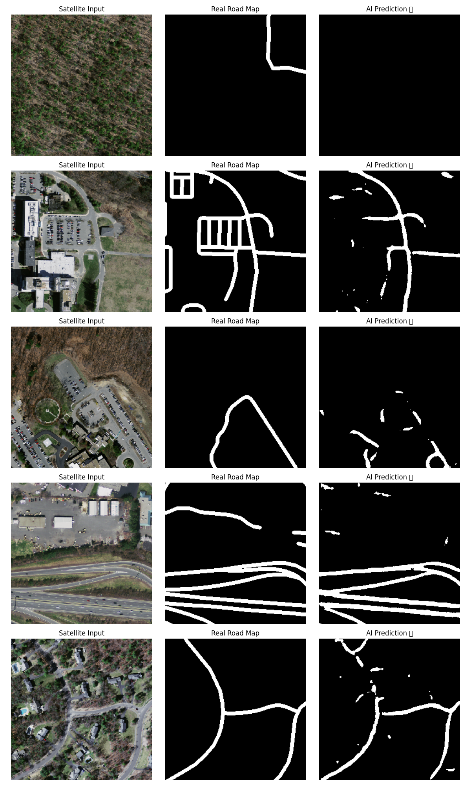

# 🛰️ Geo-Intel: Satellite Image Segmentation


## 📄 Overview
**Geo-Intel** is a Deep Learning based project designed to analyze high-resolution satellite imagery. The model is trained to perform **Semantic Segmentation**, identifying specific features (such as roads, buildings, or water bodies) from complex aerial views.

This project demonstrates the application of Computer Vision in Geospatial Intelligence.

## 📊 Results
Here is the model's prediction on test data:


*(Original Image vs. Ground Truth vs. Predicted Mask)*

## 🛠️ Tech Stack
* **Language:** Python
* **Deep Learning:** TensorFlow / Keras
* **Image Processing:** OpenCV, NumPy
* **Architecture:** CNN (Convolutional Neural Networks) for Segmentation

## 📂 Project Structure
```text
Geo_Intel_Project/
├── dataset/             # Training and Validation images (GitIgnored)
├── processed_data/      # Preprocessed arrays (GitIgnored)
├── model.py             # Model Architecture
├── train.py             # Training Script
├── predict.py           # Inference Script
├── prediction_results.png # Visual Output
└── README.md            # Project Documentation
